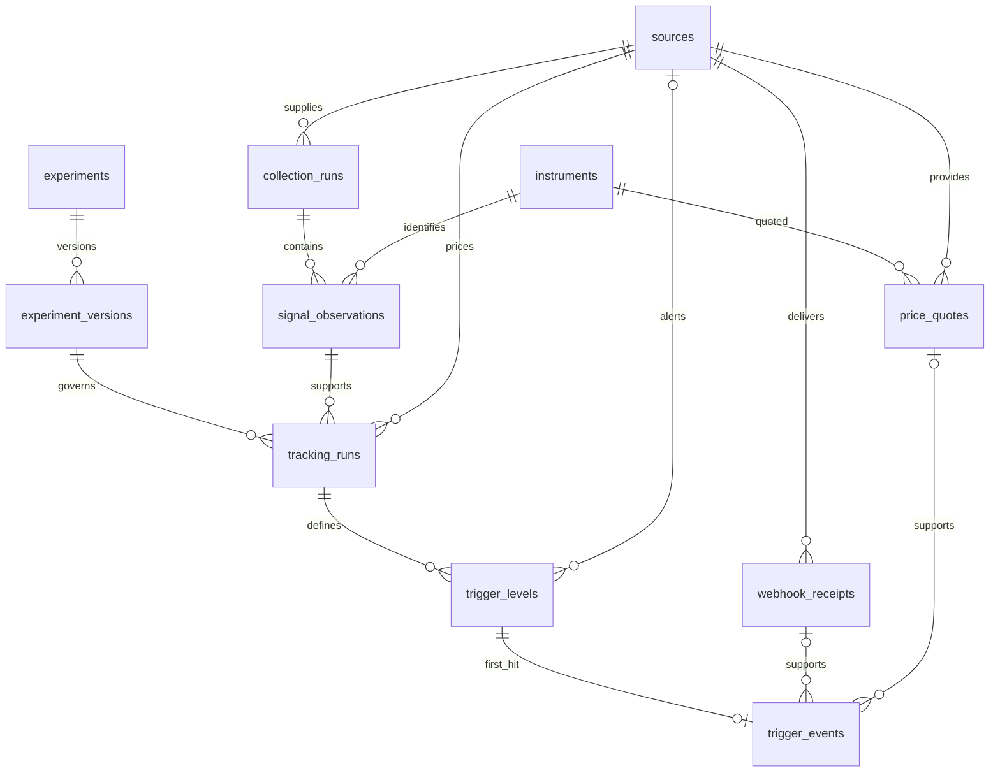

# Database design

## Implementation status

Twelve normalized tables are defined in `src/stock_radar/db/models.py` by the initial Alembic revision
`807ca9561c9f` and the quote monitoring revision `b4d1c7e9a2f3`. They support multiple sources, shared
instruments and multiple versioned experiments.
The revision was applied to the local development database on 2026-10-07; Alembic reported no model/schema
drift. Revision `b4d1c7e9a2f3` has only been applied to disposable test databases. It seeds experiment
`tradingview_losers_strong_buy` version 1; no providers, instruments or market observations are seeded. Creating this schema
does not implement financial analysis. The webhook receiver/processor now uses the existing receipt,
tracking, level and event tables without a schema change. REST/MCP collection services now use the
existing source, instrument, collection and observation tables without a schema change.

PostgreSQL 18 runs in Docker. Schema changes follow the code-first workflow below. Production migration
and VPS deployment remain separate authorized operations.

## Naming and common fields

Use English plural snake_case table names, singular PascalCase model names, and snake_case columns.
Every domain table has `id UUID PRIMARY KEY DEFAULT gen_random_uuid()` and `created_at TIMESTAMPTZ
NOT NULL DEFAULT now()`. UUIDs are random version 4 identifiers, not sequences or time-ordered IDs.
Foreign keys use UUID with the referenced table's identity. Experiment `version` is a positive revision
number, not a primary key. Alembic's internal `alembic_version` table retains its standard revision key.

Constraint names follow `pk_`, `fk_`, `uq_`, `ck_` and `ix_` conventions. All foreign keys use ON DELETE
RESTRICT to prevent accidental removal of referenced evidence. Deletion and retention workflows are
not implemented. Nullable fields represent genuinely absent data, never fabricated zero values.

Prices use NUMERIC(24, 8), percentages NUMERIC(12, 6), and mathematical threshold prices NUMERIC(38, 16).
Use Python Decimal for calculations. Instants use TIMESTAMPTZ; exchange session dates use DATE and are
interpreted in America/Sao_Paulo. `created_at` records persistence, while observation, provider event,
receipt, reference and activation times retain their distinct meanings.

## Relationships

An instrument belongs to no particular provider. Each source owns its collections; observations connect
those collections to shared instruments. The same observation may support different experiments and
versions. The tracking service allows one `prepared` or `active` run per instrument and experiment, across
versions. It serializes creation with a transaction-level advisory lock keyed by experiment and instrument;
there is no unique constraint, so rows inserted outside the service are not blocked.

`signal_kind` describes what was observed, such as analyst consensus. `analysis_kind` identifies the
method used by an experiment version, initially threshold crossing. These are separate concepts.
Tracking runs do not require trigger levels, allowing future methods to reuse the common relationships.
That capability is structural only: no additional analysis methods or generic strategy engine exist.

## Tables and integrity

| Table | Main fields and responsibility | Uniqueness and checks |
|---|---|---|
| `sources` | `code`, `name`, optional `base_url`; reusable provider identity | Unique nonblank `code` |
| `instruments` | `exchange`, `symbol`, `currency`, optional `name`; traded instrument | Unique `(exchange, symbol)`; nonblank identity; three uppercase currency letters |
| `collection_runs` | Source FK, `client_collection_id`, `payload_hash`, source URL, observed/received timestamps, session date, status, optional source total, optional rows examined, filters | Unique `(source_id, client_collection_id)`; SHA-256 hex shape; allowed status; nonnegative total |
| `signal_observations` | Collection and instrument FKs, signal kind, original symbol/column/rating, normalized rating and mapping version, observed price/change, timestamps, parse status, raw and quality evidence | Unique `(collection_run_id, instrument_id, signal_kind)`; positive supplied price; change at least -100%; allowed parse status |
| `experiments` | `code`, `name`, optional description; stable hypothesis identity | Unique nonblank `code` |
| `experiment_versions` | Experiment FK, positive `version`, nonblank `analysis_kind`, rule snapshot | Unique `(experiment_id, version)`; rules must be a JSON object |
| `tracking_runs` | Observation, experiment version and optional reference source FKs; client identity/hash; nullable reference price/time/evidence and expiry until activation; `admitted_at`; activation, lifecycle and price coverage | Unique `client_tracking_id`; positive reference; expiry after reference; activation within window; active status requires activation; reference fields and expiry are all null or all set; `active`, `completed` and `expired` require a reference |
| `trigger_levels` | Tracking FK, signed percentage, mathematical and configured prices, rounding policy, alert identity/provider/activation/expiry/evidence | Unique `(tracking_run_id, signed_percent)` and `alert_mapping_id`; nonzero percentage above -100%; positive supplied prices; valid alert window |
| `webhook_receipts` | Source FK, deduplication key, optional provider event ID and reported mapping UUID, event/receipt times, sanitized payload, processing status/attempts/errors | Unique `(source_id, deduplication_key)`; nonblank deduplication key; nonnegative attempts |
| `price_quotes` | Instrument and source FKs, price, provider market time `quoted_at`, `received_at` | Unique `(instrument_id, source_id, quoted_at)`; positive price |
| `trading_days` | `day`, `is_open`, local `opens_at` and `closes_at`, description, `origin`, `source_reference`, `consulted_on`; one row per covered calendar day | Unique `day`; hours present exactly when open, opening before closing; `origin` in `existing_configuration`, `b3_official`, `national_holidays` |
| `trigger_events` | Level FK and exactly one of receipt FK or price quote FK, supported occurrence time, observed price, evidence quality | Unique `trigger_level_id`; positive supplied price; allowed evidence quality; exactly one evidence reference |

No extra status, currency, percentage or rating lookup tables are needed. Signal and analysis kinds are
extensible text identifiers whose supported values will be validated by application services. Ratings
remain nullable when absent or unknown; raw evidence and quality details preserve the explanation.

The instrument's current symbol is a lookup value, not its permanent identity. Observations preserve the
original provider symbol. Normalize exchange/symbol values before lookup. Corporate actions, ticker
reuse and provider-specific aliases need explicit reconciliation when those integrations arrive; do not
silently merge instruments on a bare ticker. No alias or corporate-action tables are implemented yet.

## States and coverage

- Collection status: `complete`, `partial`, `failed`.
- Observation parse status: `valid`, `partial`, `invalid`.
- Tracking status: `prepared`, `active`, `completed`, `cancelled`, `expired`. There is no separate active
  flag. `admitted_at` null means a prepared run is waiting for a monitoring slot.
- Price coverage and per-level alert coverage: `unknown`, `partial`, `verified`.
- Receipt status: `pending`, `processed`, `unmapped`, `failed`.
- Event evidence quality: `timestamped`, `coarse`, `unknown`.

These value sets are CHECK constraints. Collection completeness, alert coverage and price coverage live
at their respective owners. A configured alert ID alone proves no active coverage. Evidence and interval
validation belong to the future services; the database does not certify provider claims. Unknown event
time stays null and must not be replaced by arrival time. Missing notifications cannot establish non-hits.

## Normalization and historical evidence

Relationships use FKs instead of copying provider, instrument or experiment identity into every descendant.
No result totals or hit rates are stored. Accepted observation counts can be queried; source-reported totals
are separate evidence. Reports and comparisons should initially use queries over these records.

JSONB is limited to source evidence, data-quality details, filters and versioned rules. Rules carry the
selection, reference, session/window and metric policies. Query-critical fields, lifecycle states and
relationships remain typed columns. Original and normalized values coexist intentionally for audit.
Reference and configured threshold prices are historical snapshots, not recalculated from current rules.

Experiment versions and tracking reference fields must be immutable. The tracking service writes a reference
only to a `prepared` run without one, under a row lock, and the monitor database role is the only application
role allowed to update reference columns. There are no update-blocking triggers. Corrections must preserve original
evidence and explicitly describe the correction; a full correction workflow is deferred. Do not claim
that these business policies are enforced by the schema alone.

## Retry and event semantics

Collection and tracking uniqueness provide the concurrency boundary for retries. The application must
compute a canonical payload hash, return the original result for identical retries, and reject changed
content under the same client identity. The database validates the hash shape, not its computation.
The client must reuse its request UUID on an uncertain retry. Distinct observations and deliberate runs
remain separate even when their asset or experiment matches.

A receipt stores one logical delivery. The receiver deduplicates by a source-scoped provider event ID
when supplied, otherwise by a hash of the canonical message. See [webhook identity](api/webhooks.md). Physical duplicate HTTP attempts
are not modeled individually. The optional provider event ID is evidence, not an assumed provider feature.
`reported_alert_mapping_id` deliberately has no FK: valid but unknown mappings must remain recoverable.
Unparseable original identifiers may remain in the sanitized payload instead.

A trigger event is the current first supported occurrence for one level, not every crossing. Receipts
retain the supporting history. A late earlier occurrence must update that selected event transactionally
while retaining the receipts. The processor must validate provider, mapping, run and threshold consistency
before linking a receipt to a level. FKs alone do not establish that cross-record match. Coarse or conflicting
evidence must remain ambiguous in reporting. A receipt can support several levels only when the provider
contract and its evidence actually justify it.

The first experiment requests six levels, but that count and their price formula are service rules, not
hardcoded schema constraints. Polled runs create their levels at activation with no alert fields. Server-created
runs fill `client_tracking_id` with a random UUID and `payload_hash` with a hash of their version and origin
observation. Alert reconfiguration history is deferred.
If several alert lifecycles per level become necessary, introduce a separate alert configuration table.

## Indexes and scope

Unique constraints supply indexes for identities and composite deduplication keys. Additional indexes
cover remaining FK lookups, source/time collection queries, pending receipt processing and reported alert
mapping lookup. Do not add speculative reporting indexes before concrete query requirements exist.

Revision `b4d1c7e9a2f3` adds `price_quotes`, `tracking_runs.admitted_at`, the `expired` status, nullable
reference fields and quote evidence for trigger events. Existing rows already satisfy the new checks because
their reference fields were mandatory, so the upgrade does not rewrite or consolidate tracking runs. Its
downgrade refuses to run while polling runs without a reference, expired runs or quote-backed events exist,
instead of deleting them. Run `make db-access` after `make db-migrate`: collection registration needs the new
grants on experiments and tracking runs.

## Code-first workflow

SQLAlchemy models are the source of the intended schema. `src/stock_radar/db/models.py` owns the
shared declarative Base and currently defines all twelve mapped models. Alembic loads its
metadata through `migrations/env.py`. No table creation occurs on import or application startup.
Use Alembic revisions, not `Base.metadata.create_all()`, to evolve persistent databases.

1. Define or change a mapped model and ensure it is imported by the model registry.
2. Ensure the development database is at the existing migration head.
3. Run `make db-revision MESSAGE="describe the change"` to generate a candidate in `migrations/versions/`.
4. Review its upgrade and downgrade, including potential data loss and manual data transformations.
5. Run `make db-migrate` to apply reviewed pending revisions.
6. Run `make db-check` to compare the resulting schema with registered models.

All three commands build the current image and run Alembic in Docker. They use the selected ENV_FILE
and may start PostgreSQL if needed. Generation writes migration files as the invoking user's UID/GID;
it does not apply the generated changes. Empty comparisons create no revision file. Pending existing
revisions must be applied deliberately before generating the next one. The check does not upgrade the
schema. Alembic can create its own version bookkeeping table while inspecting an uninitialized database.

Keep autogeneration on a development database. `ENV_FILE=.env.production` selects a separate database;
applying changes there requires a deliberate operator action. Nothing runs migrations during `make up`.
Review and version models and revisions together. Do not edit a revision already applied to shared data.

Autogeneration is a starting point: renames, data migrations and some constraints need manual edits.
`db-check` has the same comparison limits. Named constraints and indexes use a shared naming convention;
CHECK constraints require explicit names. Monetary columns should use Numeric and Python Decimal.
See [Alembic autogeneration](https://alembic.sqlalchemy.org/en/latest/autogenerate.html).

`stock_radar.db.config.database_url()` constructs a SQLAlchemy URL from environment variables, preserving
special characters in passwords. There is no credential in `alembic.ini`. The current migration connection
uses synchronous psycopg and NullPool, suitable for short operator commands; an API session lifecycle
is implemented for API/MCP reads and atomic collection writes. No ORM sessions or unrestricted database access are exposed to Cowork.
